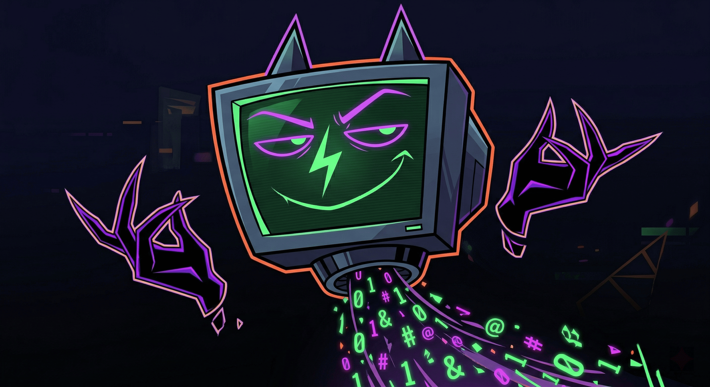

# RetroTrace

### Setup

[Arch Linux dev Setup](setup.md)

### Concept & Genre

- **Genre:** Tactical Bullet Hell / Puzzle (Hybrid-Casual).
- **Core Premise:** The tension of a bullet hell combined with the contemplative logic of a path-drawing puzzle. Time is frozen during planning; execution happens in real-time.
- **Target Platform:** Mobile (Portrait mode, One-thumb control).

### Lore & Theme

[Lore](lore.md)

### Core Mechanics

- **Two-State Loop:**
    1. *Planning State (Time = 0):* Player draws a freeform spline (Bézier curve) to navigate around stationary bullets and traps. Bullets show "ghost" vectors of their future trajectories.
    2. *Execution State (Time = 1):* Player hits "Play". Time unfreezes, bullets move, and the avatar traverses the drawn path at a constant speed.
- **Controls:** Draw with one thumb. Scrub backward on the drawn line to undo/rewind without lifting the finger.
- **Win/Loss:** Reach the exit portal/node to win. Any collision with a bullet/trap hit-box results in instant death and rapid reset.

[Game Modes](game_modes.md)

### Visual Identity

- **Visual Style:** "Programmer Art" elevated by heavy post-processing. Low-poly primitive shapes, Unlit materials, heavy Neon/Bloom, Vignette, and Chromatic Aberration.

### Hacks (Active Skills / Procedural Acrobatics)

- **Packet Overclock (Dash):** Aggressive forward lean, determined face, long solid light trail, screen shake.
- **Sector Defrag (Ghost/Intangible):** Glitchee disintegrates into an ASCII/binary particle swarm to pass through walls of bullets.
- **Buffer Overflow (Repel):** Error icon on screen, emits a procedural shockwave that recalculates/bounces incoming bullets away.

### Camera System

- **Planning Phase:** Strict Top-down (Orthographic) for tactical precision.
- **Execution Phase:** Procedural Cinematic Camera. Tilts down to a chase perspective, uses *LookAt* to anticipate upcoming curves on the spline, and dynamically adjusts FOV based on speed and near-misses.

### Technical Architecture & Engineering

- **Languages:** Rust (Focus on performance, memory safety, and determinism) and GDScript (to handle visual elements & utilities like ads).
- **Physics:** 100% Deterministic. Floating-point precision must be strictly managed to ensure the outcome calculated during the Planning State matches the Execution State exactly.
- **Level Generation:**

[Level Generation Algorithm](level_generation.md)

[Traps](traps.md)

- Abstract digital environment.
- Slightly reflective black floor.
- Retro technology.
- Vaporwave elements.
- Dark vaporwave palette.
- Three-dimensional.
- Central room with free form, an irregular polygon. It should occupy 60% of the image. Inside it, cannons firing luminous balls in all directions. It should have a slightly reflective black floor.
- Around this room, an abstract environment with vaporwave statues represented in a two-dimensional way. In addition, abstract digital geometric shapes. The edges of this environment should have a very irregular and random shape. The edges should be subtle.
- Further out, outside this environment, a slightly blurry background with old computer parts. It should not occupy much of the image.
- Well-spaced objects.
- Make all 3D shapes much more simplified, low-poly. But keep the realistic shading, with reflectivity on the floor.
- Keep the perspective non-isometric (realistic).
- All this will be seen in a top-down perspective.
